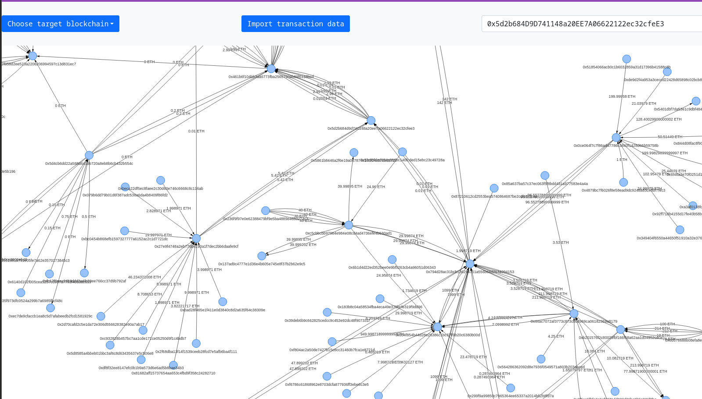
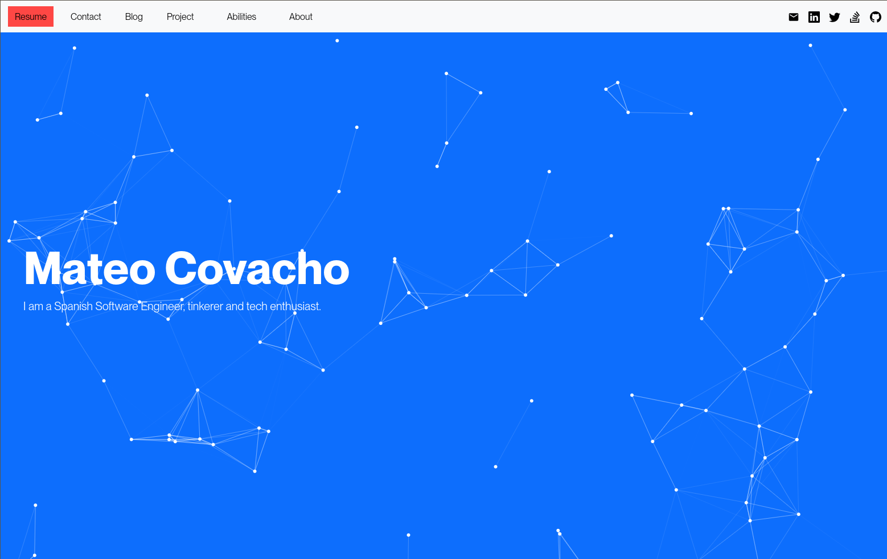

# [mateocovacho.com](https://mateocovacho.com/)

# Mateo Covacho

## Lifelong tinkerer and software engineer  

## My projects

# Network Explorer //  graph-pp

An App to allow users to visualize data represented in network graph form datasets such as blaockain transactions, spread of a virurs. Additionally users can import their own JSON data using this simple format, 

Technologies: Graph search algorithms, Cloud computing, AWS Lambda, Third party API, Big data processing, Data visualization, vis.js, and more.

# Developer protfolio

My [Photo showcasing the blockchain transaction scraping functionality of graph-app](https://mateocovacho.com/). I use this project to showcase my projects and elaborate on my development process for each of them.

Technologies: Sleek frontend design

# Leak Shield

LeakShield is a tool that helps content creators and managers protect their content and revenue from unauthorized access or distribution. By embedding each copy of content with a unique identifier, LeakShield can then trace the source of unauthorized copies and take action to protect the content. It's implemented as a software application or service and can be integrated into social media platforms.

Technologies: Frontend design, and more.

# Visitor count

